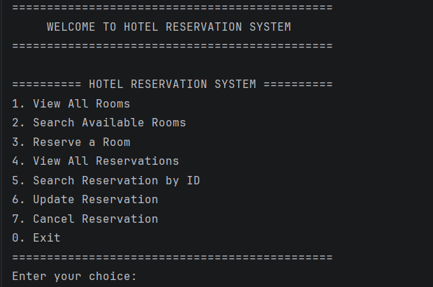
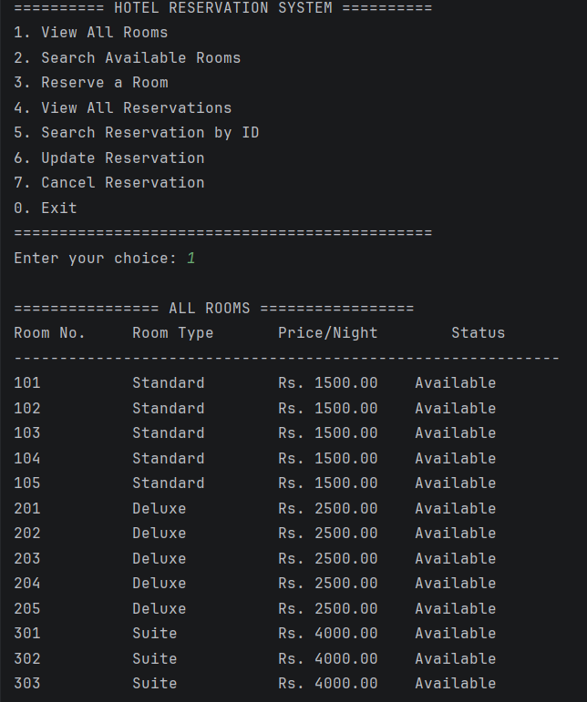
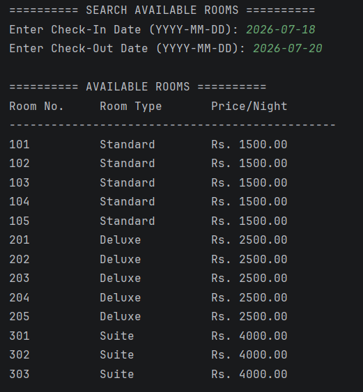
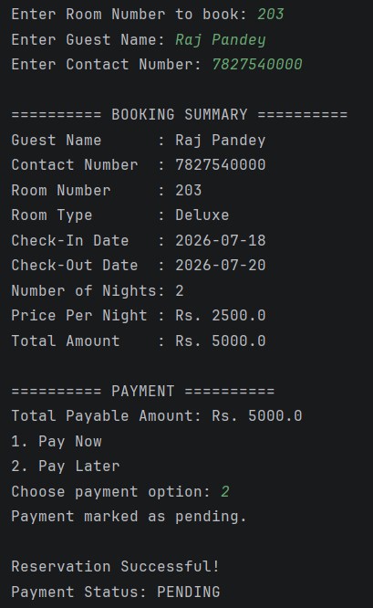
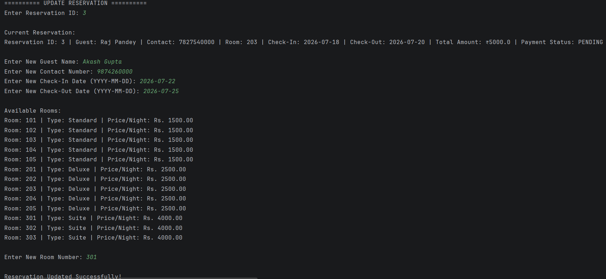
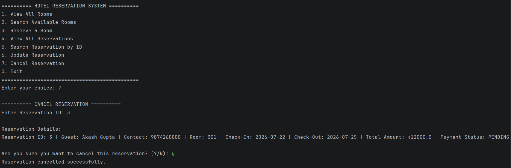

# 🏨 Hotel Reservation Management System

A secure and modular **console-based Hotel Reservation Management System** developed using **Core Java, JDBC, and MySQL**.

This project allows users to search available hotel rooms, make reservations, manage bookings, calculate total costs, simulate payments, and prevent double bookings using date-based room availability checks.

This project was developed as part of the **CodeAlpha Java Programming Internship**.

---

## 📌 Project Overview

The Hotel Reservation Management System is designed to simplify basic hotel booking operations through a console-based Java application.

The system provides room management and reservation functionality while using **JDBC** to communicate with a **MySQL database**.

The project follows a layered structure by separating:

- Model classes
- Database connection logic
- Data Access Objects (DAO)
- Business logic
- User interaction

This makes the application easier to maintain, understand, and extend.

---

## ✨ Key Features

### 🏨 Room Management

- View all hotel rooms
- Search available rooms by check-in and check-out dates
- Support for multiple room categories:
  - Standard
  - Deluxe
  - Suite
- Different pricing based on room category

### 📅 Reservation Management

- Create a new room reservation
- View all reservations
- Search reservation by Reservation ID
- Update existing reservation details
- Cancel reservations
- Auto-generated Reservation ID
- Reservation timestamp

### 🔍 Smart Room Availability

- Date-based room availability checking
- Prevents overlapping reservations
- Prevents double booking
- Supports back-to-back bookings
- Ignores the current reservation while updating a booking

### 💰 Billing & Payment

- Automatic number-of-nights calculation
- Automatic total bill calculation
- Room-category-based pricing
- Payment simulation
- Payment status:
  - `PAID`
  - `PENDING`

### 🔐 Security & Validation

- JDBC `PreparedStatement` for secure SQL queries
- Protection against SQL injection
- 10-digit contact number validation
- Guest name validation
- Check-in and check-out date validation
- Invalid input handling
- Database password managed using environment variables
- Exception handling for database operations

---

## 🛠️ Technologies Used

| Technology | Purpose |
|---|---|
| Java | Core application development |
| JDBC | Java-MySQL database connectivity |
| MySQL | Database management |
| IntelliJ IDEA | Development environment |
| Git | Version control |
| GitHub | Source code hosting |

---

## 🏗️ Project Architecture

The application follows a layered architecture:

```text
User
  │
  ▼
HotelReservationSystem.java
  │
  ▼
HotelService.java
  │
  ├───────────────┐
  ▼               ▼
RoomDAO.java    ReservationDAO.java
  │               │
  └───────┬───────┘
          ▼
DatabaseConnection.java
          │
          ▼
      MySQL Database
```

---

## 📂 Project Structure

```text
HotelReservationSystem/
│
├── src/
│   ├── HotelReservationSystem.java
│   ├── HotelService.java
│   ├── Room.java
│   ├── Reservation.java
│   ├── RoomDAO.java
│   ├── ReservationDAO.java
│   └── DatabaseConnection.java
│
├── screenshots/
│
├── database.sql
├── .gitignore
└── README.md
```

### File Responsibilities

#### `HotelReservationSystem.java`

Main entry point of the application.

Handles:

- Main menu
- User input
- Room booking interaction
- Reservation search
- Reservation updates
- Reservation cancellation

#### `HotelService.java`

Contains the main business logic.

Handles:

- Date validation
- Room availability
- Number of nights calculation
- Total bill calculation
- Reservation creation
- Payment simulation

#### `Room.java`

Model class representing a hotel room.

Stores:

- Room number
- Room type
- Price per night
- Availability status

#### `Reservation.java`

Model class representing a reservation.

Stores:

- Reservation ID
- Guest name
- Contact number
- Room number
- Check-in date
- Check-out date
- Total amount
- Payment status

#### `RoomDAO.java`

Handles database operations related to hotel rooms.

Includes:

- Fetch all rooms
- Find room by room number
- Search available rooms
- Check room availability
- Update-specific availability checking

#### `ReservationDAO.java`

Handles database operations related to reservations.

Includes:

- Add reservation
- View reservations
- Search reservation by ID
- Update reservation
- Cancel reservation

#### `DatabaseConnection.java`

Handles the connection between the Java application and MySQL database.

Database credentials are configured using environment variables for improved security.

---

## 🗄️ Database Structure

The project uses a MySQL database named:

```text
hotel_db
```

It contains two main tables:

### `rooms`

| Column | Description |
|---|---|
| `room_no` | Unique room number |
| `room_type` | Standard, Deluxe, or Suite |
| `price_per_night` | Room price per night |
| `is_available` | Room operational availability |

### `reservations`

| Column | Description |
|---|---|
| `reservation_id` | Auto-generated reservation ID |
| `guest_name` | Name of the guest |
| `contact_number` | Guest contact number |
| `room_no` | Reserved room number |
| `check_in_date` | Check-in date |
| `check_out_date` | Check-out date |
| `total_amount` | Total booking amount |
| `payment_status` | PAID or PENDING |
| `reservation_date` | Reservation creation timestamp |

---

## 🛏️ Room Categories & Pricing

| Room Type | Room Numbers | Price Per Night |
|---|---|---:|
| Standard | 101–105 | Rs. 1500 |
| Deluxe | 201–205 | Rs. 2500 |
| Suite | 301–303 | Rs. 4000 |

---

## 🔄 Application Menu

```text
========== HOTEL RESERVATION SYSTEM ==========

1. View All Rooms
2. Search Available Rooms
3. Reserve a Room
4. View All Reservations
5. Search Reservation by ID
6. Update Reservation
7. Cancel Reservation
0. Exit

==============================================
```

---

## 🚀 How to Run the Project

### Prerequisites

Make sure you have installed:

- Java JDK 8 or later
- MySQL Server
- MySQL Connector/J
- IntelliJ IDEA or another Java IDE

---

### 1. Clone the Repository

Clone this repository to your local system:

```bash
git clone https://github.com/rajpandey4706/CodeAlpha_HotelReservationSystem.git
```

Open the project in IntelliJ IDEA.

---

### 2. Setup MySQL Database

Open MySQL and execute the provided:

```text
database.sql
```

The script will:

- Create the `hotel_db` database
- Create the `rooms` table
- Create the `reservations` table
- Insert sample Standard rooms
- Insert sample Deluxe rooms
- Insert sample Suite rooms

> **Warning:** The provided SQL setup script drops existing `rooms` and `reservations` tables before recreating them. Running it will remove existing reservation data.

---

### 3. Configure Database Credentials

The application reads the MySQL password from an environment variable.

Set:

```text
HOTEL_DB_PASSWORD=your_mysql_password
```

The default MySQL username is:

```text
root
```

If you use a different username, also configure:

```text
HOTEL_DB_USERNAME=your_mysql_username
```

### IntelliJ IDEA Setup

Go to:

```text
Run
→ Edit Configurations
→ HotelReservationSystem
→ Environment Variables
```

Add your database password:

```text
HOTEL_DB_PASSWORD=your_mysql_password
```

Apply the changes and run the application.

---

### 4. Add MySQL JDBC Driver

Make sure **MySQL Connector/J** is added to the project's dependencies.

The application requires the MySQL JDBC driver to connect Java with the MySQL database.

---

### 5. Run the Application

Run:

```text
HotelReservationSystem.java
```

The main menu will appear in the console.

---

## 🧠 Double Booking Prevention

The application checks existing reservations before allowing a room to be booked.

A room is considered unavailable when an existing reservation overlaps with the requested booking dates.

Conceptually:

```text
Existing Check-In < Requested Check-Out
AND
Existing Check-Out > Requested Check-In
```

This prevents overlapping reservations while still allowing back-to-back bookings.

Example:

```text
Existing Booking:
20 July → 25 July

Requested:
22 July → 24 July
Result: Not Available ❌
```

But:

```text
Existing Booking:
20 July → 25 July

Requested:
25 July → 28 July
Result: Available ✅
```

---

## 💳 Payment Simulation

During reservation, users can choose:

```text
1. Pay Now
2. Pay Later
```

Payment status is stored as:

```text
Pay Now   → PAID
Pay Later → PENDING
```

This is a simulated payment system and does not connect to a real payment gateway.

---

## 🔒 Security

The project uses:

- `PreparedStatement` for database queries
- Environment variables for database credentials
- Input validation
- Exception handling

Sensitive database passwords are not stored directly in the Java source code.

> Never commit your real MySQL password or `.env` files to GitHub.

---

## 📸 Screenshots

Project screenshots can be added inside the `screenshots` directory.

## 📸 Screenshots

### Main Menu


### View All Rooms


### Search Available Rooms


### Reservation Successful


### View All Reservations


### Update Reservation


### Cancel Reservation


---

## 🔮 Future Enhancements

Future improvements may include:

- Java Swing or JavaFX GUI
- Spring Boot REST API
- User login and authentication
- Admin dashboard
- Online payment gateway integration
- Email booking confirmation
- PDF invoice generation
- Advanced room filtering
- Booking history
- Hibernate/JPA integration

---

## 🎯 Learning Outcomes

Through this project, I gained practical experience with:

- Core Java
- Object-Oriented Programming (OOP)
- JDBC
- MySQL
- DAO Design Pattern
- CRUD Operations
- SQL Queries
- Prepared Statements
- Date Handling
- Input Validation
- Exception Handling
- Environment Variables
- Layered Application Architecture

---

## 👨‍💻 Author

**Raj Pandey**

MCA Student | Java Developer

GitHub: `rajpandey4706`

---

## 📜 Internship

This project was developed as part of the **CodeAlpha Java Programming Internship**.

**Task:** Hotel Reservation System

---

## ⭐ Support

If you find this project useful, consider giving the repository a ⭐ on GitHub.
