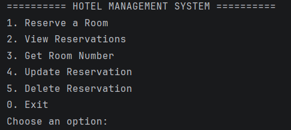
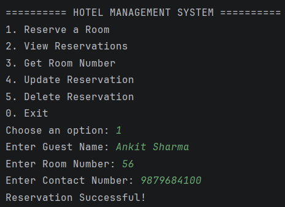
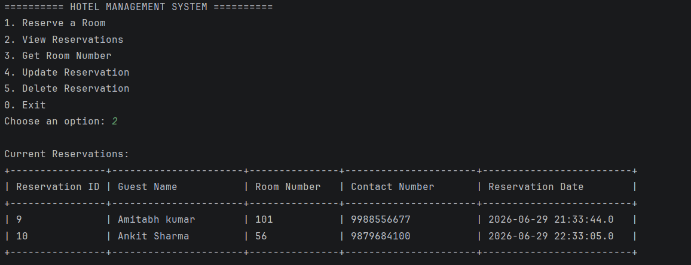
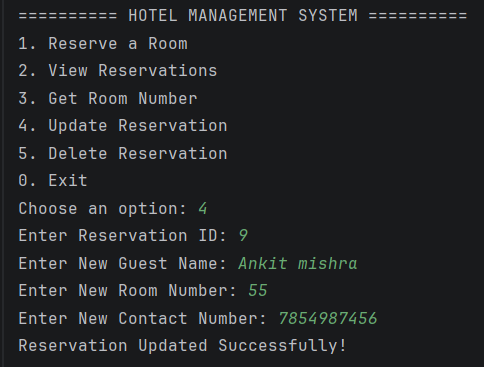
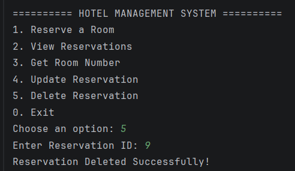

# 🏨 Hotel Reservation Management System

A secure and modular Hotel Reservation Management System developed using Core Java, JDBC, and MySQL. The application implements CRUD operations, database connectivity, input validation, and SQL Injection protection using PreparedStatement while following industry-standard JDBC practices.

---

## ✨ Features

- Reserve a Room
- View Reservations
- Get Room Number by Reservation ID
- Update Reservation Details
- Delete Reservations
- Contact Number Validation
- SQL Injection Protection using PreparedStatement
- Auto-generated Reservation IDs
- Timestamp-based Reservation Records
- Modular and Menu-driven Console Application

---

## 🛠️ Technologies Used

- Core Java
- JDBC
- MySQL
- SQL
- PreparedStatement
- Object-Oriented Programming (OOP)
- Exception Handling
- IntelliJ IDEA
- Git & GitHub

---

## 🗄️ Database Schema

```sql
CREATE DATABASE IF NOT EXISTS hotel_db;

USE hotel_db;

CREATE TABLE IF NOT EXISTS reservations (
    reservation_id INT PRIMARY KEY AUTO_INCREMENT,
    guest_name VARCHAR(100) NOT NULL,
    room_no INT NOT NULL,
    contact_number VARCHAR(10) NOT NULL,
    reservation_date TIMESTAMP DEFAULT CURRENT_TIMESTAMP
);
```

---

## 🚀 How to Run

1. Clone the repository:

```bash
git clone https://github.com/rajpandey4706/HotelReservationSystem.git
```

2. Create the database using `database.sql`.

3. Update JDBC credentials in `HotelReservationSystem.java`:

```java
private static final String URL = "jdbc:mysql://localhost:3306/hotel_db";
private static final String USERNAME = "root";
private static final String PASSWORD = "your_password";
```

4. Run `HotelReservationSystem.java`.

---

## 📸 Application Screenshots

### Main Menu


### Reservation Successful


### View Reservations


### Update Reservation


### Delete Reservation


---

## 📁 Project Structure

```text
HotelReservationSystem
│
├── src
│   └── HotelReservationSystem.java
├── screenshots
│   ├── menu.png
│   ├── reservation-successful.png
│   ├── view-reservations.png
│   ├── reservation-update.png
│   └── reservation-deleted.png
├── database.sql
├── README.md
└── .gitignore
```

---

## 👨‍💻 Author

**Raj Pandey**  
MCA Student | Java Developer | JDBC & MySQL Enthusiast
